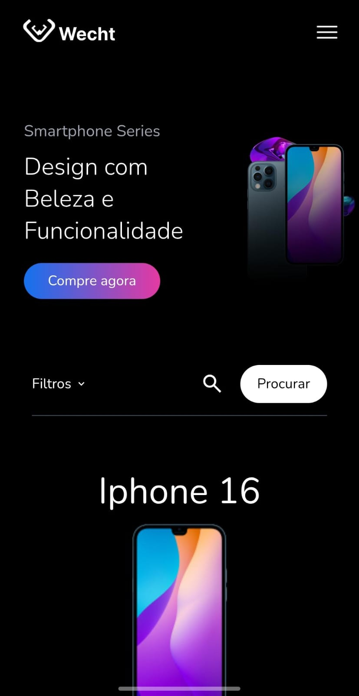
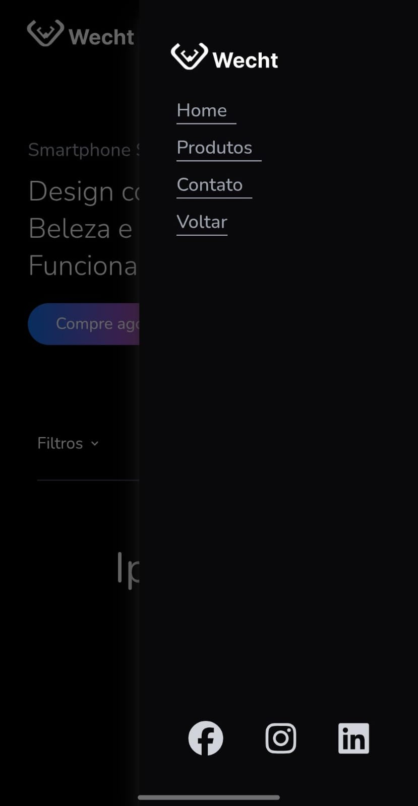

# Landing Page - E-commerce de Smartphones e Smartwatches


## 📖 Descrição do Projeto

Este repositório contém o código-fonte de uma **landing page responsiva** que simula a página inicial de um e-commerce especializado em smartphones e smartwatches. O objetivo principal do projeto é aplicar conceitos de **HTML**, **TailwindCSS** e **TypeScript**, criando uma estrutura bem organizada e estilizada, além de oferecer uma experiência visual atrativa para os usuários.

A página apresenta:

- 🎨 **Design Responsivo**: Adaptação a diferentes dispositivos (desktop, tablet e mobile).
- 🛒 **Simulação de E-commerce**: Elementos visuais e interativos que recriam uma experiência real de compra online.
- 🧩 **Estrutura Clara**: Navegação intuitiva e organização eficiente.

---

## 🌐 Demonstração

### 💻 Captura de Tela - Versão Desktop


### 📱 Captura de Tela - Versão Mobile




---

## 🛠 Tecnologias Utilizadas

- **HTML5**: Para estruturar o conteúdo da página.
- **TailwindCSS**: Para estilização e design responsivo.
- **TypeScript**: Para adicionar interatividade e funcionalidades dinâmicas.
- **Git**: Para controle de versão.
- **Vite**: Para um ambiente de desenvolvimento rápido e eficiente.

---

## 🚀 Como Utilizar

1. Clone este repositório para sua máquina local:

   ```bash
   git clone https://github.com/Adrwaan/Wecht.git
   ```

2. Acesse o diretório do projeto:

   ```bash
   cd Wecht
   ```

3. Instale as dependências necessárias:

   ```bash
   npm install
   ```

   ou

   ```bash
   pnpm install
   ```

4. Inicie o ambiente de desenvolvimento:

   ```bash
   npm run dev
   ```

   ou

   ```bash
   pnpm dev
   ```

5. Abra o navegador e acesse o endereço exibido no terminal.

---

## ✨ Funcionalidades Implementadas

- **Design Responsivo**: Uso do TailwindCSS para adaptar o layout a diferentes tamanhos de tela.
- **Elementos Interativos**: Botões e scripts simulando funcionalidades de um e-commerce.
- **Organização Visual**: Apresentação dos produtos de forma clara e atrativa.

---

## 👤 Autor

Desenvolvido por [**Adrwaan**](https://github.com/Adrwaan).
